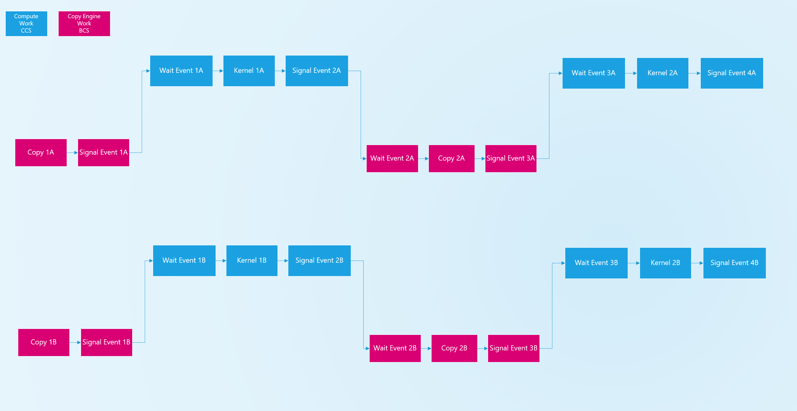

# Compute usage guide
Contact: michal.mrozek@intel.com

## Command Submission - Deadlock avoidance
### Level Zero Engine exposure and deadlocks
According to Level Zero specification it is application responsibility to make sure there are no deadlocks.

[Deadlock definition](https://spec.oneapi.io/level-zero/latest/core/PROG.html?highlight=deadlock#events)

`*There are no protections against events causing deadlocks, such as circular waits scenarios.*`

`*These problems are left to the application to avoid.* `

Let's look at some scenarios that may introduce deadlocks.

In Level Zero each engine is exposed as physical instance.
Application while creating command queues creates direct connection to physical 
resources. 

Engine discovery uses Command Queue Groups approach, explained [here](https://spec.oneapi.io/level-zero/latest/core/PROG.html#command-queue-groups).

In this example two middle Command Queues are using underneath single CCS1 (Compute Command Streamer) instance:


The Level Zero implementation also is allowed to share the same physical hardware context for [multiple queues](https://spec.oneapi.io/level-zero/latest/core/PROG.html#command-queues):

`Multiple command queues created for the same command queue group on the same context, may also share the same physical hardware context.`

It means that independent user queues, which utilize the same physical hardware queue instance, may be executed within single Hardware context.
What it also means is that if one queue blocks given hardware engine from execution, then other users of this engine will not be able to make forward progress.

Level Zero also specifies what happens when multiple queues use the same index:

` Command queues that share the same index launch sequentially but may execute concurrently. `

It means that there is no guarantee of concurrency for submission to the same index and each launch is serialized.

The concurrent launch may only happen across different indexes, but again it is not guaranteed:

` Command queues that do not share the same index may launch and execute concurrently. `

` There is no guarantee that command lists submitted to command queues with different indices will execute concurrently, only a possibility that they might execute concurrently. `

Which means that layers built on top of Level Zero that use the same indexes needs to be very careful with their submission to make sure they do not block the engine from other users.
Due to sequential nature of each launch on the same index, it is possible to block the engine until all commands within launch are done.

### Deadlock samples (1) - blocking engine on host signaled event

Level Zero allows events to be signaled from the host.
This code sequence will block the engine until host signals event:

```c++
//create immediate command list with index and ordinal set to 0
ze_command_queue_desc_t cmdQueueDesc = {};
cmdQueueDesc.mode = ZE_COMMAND_QUEUE_MODE_ASYNCHRONOUS;
cmdQueueDesc.ordinal = 0;
cmdQueueDesc.index = 0;
zeCommandListCreateImmediate(context, device, &cmdQueueDesc, &cmdList);

//create non-signaled event
zeEventCreate(eventPool, &eventDesc, &event);
//pass event as dependency for kernel submission via immediate command list
zeCommandListAppendLaunchKernel(cmdList, kernel, &groupCount, nullptr, 1, &event);
```

Until event is signaled, the physical engine doing the execution of above code is blocked on non-signaled dependency.
There may be completely new immediate command list created using the same engine and it will not be able to execute kernel without any dependencies.

```c++
//create immediate command list with index and ordinal set to 0
ze_command_queue_desc_t cmdQueueDesc = {};
cmdQueueDesc.mode = ZE_COMMAND_QUEUE_MODE_SYNCHRONOUS;
cmdQueueDesc.ordinal = 0;
cmdQueueDesc.index = 0;
zeCommandListCreateImmediate(context, device, &cmdQueueDesc, &cmdList2);

//this one will stall until event is signaled
zeCommandListAppendLaunchKernel(cmdList2, kernel2, &groupCount, nullptr, 0, nullptr);

//too late to set event from here
zeEventHostSignal(event);
```

Until event is signaled from the host, kernel2 will not be able to run, cmdList2 is synchronous so every append operation
on it waits until it is completed. This is new command lists without any dependencies, but it is using the same engine
that is currently occupied by dependency for kernel which is not resolved. So this API sequence would stall endlessly on append
for kernel2 and the code will never reach to zeEventHostSignal(event).

**The same applies to command queues scenarios.**

Recommendations:
1. Avoid signaling events from the host.
2. Avoid submitting work that is dependent on host signaled events.
3. When work is dependent on task that execute on the host, submit the command list when host task is done, without programming the wait on
event at all.


### Deadlock samples (2) - blocking engine via circular multi engine dependencies

Let us look at following use case.
We have 2 users, they are both doing the same sequence within order lists/queues:

1. copy data from host to device using copy engine.
2. do computation on the compute engine.
3. copy data from device to host.
4. do computation on the compute engine.

All above operations must be executed in specific order.

Here is also a picture illustrating this scenario:


This may be implemented by creating 2 command lists containing following recorded commands:

```c++
//Command List 1 - contains copy submissions
zeCommandListAppendMemoryCopy(bcsCommandListA, no wait events, signal event1a);
zeCommandListAppendMemoryCopy(bcsCommandListA, wait on event2a, signal event3a);

//Command List 2 - contains compute submissions 
zeCommandListAppendLaunchKernel(ccsCommandListA, wait on event1a, signal event2a);
zeCommandListAppendLaunchKernel(ccsCommandListA, wait on event3a, signal event4a);
```

Which are further submitted to 2 queues (one doing compute operations and one doing copy operations):
```c++
zeCommandQueueExecuteCommandLists(computeCommandQueueA, 1, &ccsCommandListA, nullptr);
zeCommandQueueExecuteCommandLists(copyCommandQueueA, 1, &bcsCommandListA, nullptr);
```
Situation is not problematic if there is nothing else running on those engines, but as soon as there are resource contention problems may arise.
Let's consider that within a process sharing single Level Zero driver instance, 2 non-related upper level libraries do above situation.
It may happen that between one library submission there is another library submission, so those submissions that targets the same engines starts to interleave between each other.

For simplicity let us consider that they do the same scenario
Workload 1 does

copy on bcs (event1a) -> compute on ccs  (event2a) -> copy on bcs (event3a) -> copy on ccs (event4a) 

Workload 2 does

copy on bcs (event1b) -> compute on ccs  (event2b) -> copy on bcs (event3b) -> copy on ccs (event4b) 

This ends up in 4 command queue submissions, 2 to compute and 2 to copy queues.
It happens that those submission interleave with each other:

```c++
zeCommandQueueExecuteCommandLists(computeCommandQueueA, 1, &ccsCommandListA, nullptr);
zeCommandQueueExecuteCommandLists(computeCommandQueueB, 1, &ccsCommandListB, nullptr);
zeCommandQueueExecuteCommandLists(copyCommandQueueB, 1, &bcsCommandListB, nullptr);
zeCommandQueueExecuteCommandLists(copyCommandQueueA, 1, &bcsCommandListA, nullptr);
```

Which generates following traffic on each engine:

```c++
CCS engine

zeCommandListAppendLaunchKernel(ccsCommandListA, wait on event1a, signal event2a);
zeCommandListAppendLaunchKernel(ccsCommandListA, wait on event3a, signal event4a);
zeCommandListAppendLaunchKernel(ccsCommandListB, wait on event1b, signal event2b);
zeCommandListAppendLaunchKernel(ccsCommandListB, wait on event3b, signal event4b);

BCS engine

zeCommandListAppendMemoryCopy(bcsCommandListB, no wait events, signal event1b);
zeCommandListAppendMemoryCopy(bcsCommandListB, wait on event2b, signal event3b);
zeCommandListAppendMemoryCopy(bcsCommandListA, no wait events, signal event1a);
zeCommandListAppendMemoryCopy(bcsCommandListA, wait on event2a, signal event3a);

```

which creates following execution sequence:


```c++
CCS engine
1. wait on event1a, signal event2a
2. wait on event3a, signal event4a
3. wait on event1b, signal event2b
4. wait on event3b, signal event4b

BCS engine

1. signal event1b
2. wait on event2b, signal event3b
3. signal event1a
4. wait on event2a, signal event3a

```
Which is illustrated by this picture:


Let us now look at BCS engine.
In the second step it waits on event2b, this is synchronization points to until this happens engine is blocked.

event2b will be signaled by step #3 of CCS command list, which depends on signaling of following events:

event1b, event3a and event1a

But event1a is signaled in step #3 of BCS submission, so after operation #2 is done.
This creates a deadlock because operation #2 on BCS engine block operation #3 which would further unblock it.

This simplified picture shows this as well:


**How to avoid it?**

Some rules to follow that helps to avoid deadlocks:
1. Do not submit circular dependencies in command list, break command lists into smaller ones to break the circle.
2. Submit command lists in proper order, avoid submitting command list that doesn't have all dependencies submitted.
3. Commands submitted to the GPU can only use (input) events that will be signaled by other already-submitted commands.

**Applying rules to resolve deadlock**

Let's try to apply rules on sample above to see how deadlock is resolved.
If we look at the initial programming:

```c++
CCS engine

zeCommandListAppendLaunchKernel(ccsCommandListA, wait on event1a, signal event2a);
zeCommandListAppendLaunchKernel(ccsCommandListA, wait on event3a, signal event4a);
zeCommandListAppendLaunchKernel(ccsCommandListB, wait on event1b, signal event2b);
zeCommandListAppendLaunchKernel(ccsCommandListB, wait on event3b, signal event4b);

BCS engine

zeCommandListAppendMemoryCopy(bcsCommandListB, no wait events, signal event1b);
zeCommandListAppendMemoryCopy(bcsCommandListB, wait on event2b, signal event3b);
zeCommandListAppendMemoryCopy(bcsCommandListA, no wait events, signal event1a);
zeCommandListAppendMemoryCopy(bcsCommandListA, wait on event2a, signal event3a);

```

We can see that there is a circular dependency between BCS and CCS for second kernel in each command list.
So, first thing that we do is to split those command list into smaller ones:

```c++

CCS engine
zeCommandListAppendLaunchKernel(ccsCommandListA, wait on event1a, signal event2a);
zeCommandListAppendLaunchKernel(ccsCommandList2A, wait on event3a, signal event4a);
zeCommandListAppendLaunchKernel(ccsCommandListB, wait on event1b, signal event2b);
zeCommandListAppendLaunchKernel(ccsCommandList2B, wait on event3b, signal event4b);

BCS engine

zeCommandListAppendMemoryCopy(bcsCommandListB, no wait events, signal event1b);
zeCommandListAppendMemoryCopy(bcsCommandListB, wait on event2b, signal event3b);
zeCommandListAppendMemoryCopy(bcsCommandListA, no wait events, signal event1a);
zeCommandListAppendMemoryCopy(bcsCommandListA, wait on event2a, signal event3a);

```

BCS command list doesn't have circular dependencies, so they don't need to be modified.
Now let's look at the initial submission order:

```c++
zeCommandQueueExecuteCommandLists(computeCommandQueueA, 1, &ccsCommandListA, nullptr);
zeCommandQueueExecuteCommandLists(computeCommandQueueB, 1, &ccsCommandListB, nullptr);
zeCommandQueueExecuteCommandLists(copyCommandQueueB, 1, &bcsCommandListB, nullptr);
zeCommandQueueExecuteCommandLists(copyCommandQueueA, 1, &bcsCommandListA, nullptr);
```

Initially we were submitting command lists in order that was not respecting dependencies.
CCS submissions were done earlier then BCS submissions, even though they were dependent on those.

Let's change the order of submission to respect dependencies:

```c++
//submit to BCS first as CCS is dependent on BCS
zeCommandQueueExecuteCommandLists(copyCommandQueueB, 1, &bcsCommandListB, nullptr);
zeCommandQueueExecuteCommandLists(copyCommandQueueA, 1, &bcsCommandListA, nullptr);
//now submit to CCS
zeCommandQueueExecuteCommandLists(computeCommandQueueA, 1, &ccsCommandListA, nullptr);
zeCommandQueueExecuteCommandLists(computeCommandQueueB, 1, &ccsCommandListB, nullptr);
zeCommandQueueExecuteCommandLists(computeCommandQueue2A, 1, &ccsCommandListA, nullptr);
zeCommandQueueExecuteCommandLists(computeCommandQueue2B, 1, &ccsCommandListB, nullptr);
```

But here we have another problem, we are submitting to BCS command list that is dependent on CCS command list.
So, we may run into the same problem as before, but this time it is not a circular dependency, but a dependency on not yet submitted command list.
In order to fix that, we need to split BCS command list into 2 command lists, one that is dependent on CCS and one that is not:

```c++
zeCommandListAppendMemoryCopy(bcsCommandListB, no wait events, signal event1b);
zeCommandListAppendMemoryCopy(bcsCommandList2B, wait on event2b, signal event3b);
zeCommandListAppendMemoryCopy(bcsCommandListA, no wait events, signal event1a);
zeCommandListAppendMemoryCopy(bcsCommandList2A, wait on event2a, signal event3a);
```

which finally generates following submission sequence:

```c++
//submit to BCS first as CCS is dependent on BCS
zeCommandQueueExecuteCommandLists(copyCommandQueueB, 1, &bcsCommandListB, nullptr);
zeCommandQueueExecuteCommandLists(copyCommandQueueA, 1, &bcsCommandListA, nullptr);
//now submit to CCS
zeCommandQueueExecuteCommandLists(computeCommandQueueA, 1, &ccsCommandListA, nullptr);
zeCommandQueueExecuteCommandLists(computeCommandQueueB, 1, &ccsCommandListB, nullptr);
//now submit to BCS what was dependent on CCS
zeCommandQueueExecuteCommandLists(copyCommandQueue2B, 1, &bcsCommandListB, nullptr);
zeCommandQueueExecuteCommandLists(copyCommandQueue2A, 1, &bcsCommandListA, nullptr);
//and finally submit to CCS what was dependent on second BCS submission
zeCommandQueueExecuteCommandLists(computeCommandQueue2A, 1, &ccsCommandListA, nullptr);
zeCommandQueueExecuteCommandLists(computeCommandQueue2B, 1, &ccsCommandListB, nullptr);
```

Now no matter how those command lists submissions are interleaved, there is no circular dependencies between them, so there is no deadlock.
Here is sample picture illustrating this:
